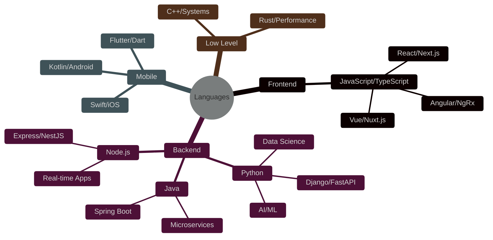
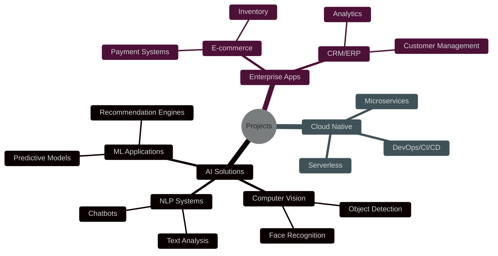
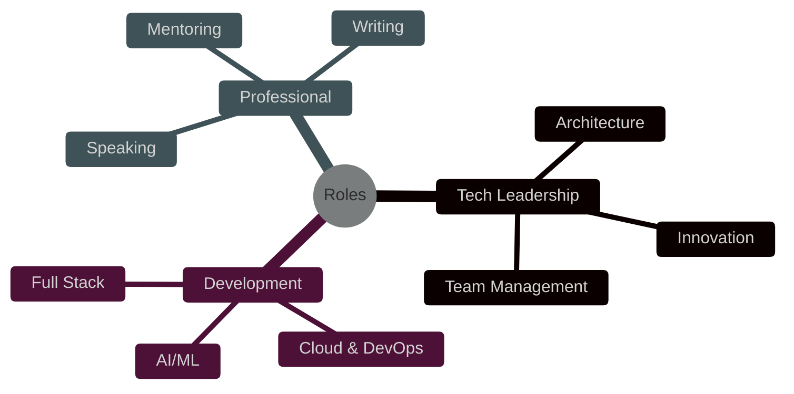

  <!-- Banner animado -->
  
  
  <!-- Título Principal Animado -->
  <h1>
    
  </h1>

  <!-- Subtítulos Animados -->
  

  <!-- Contador de Visitas -->
  
  
    
  
  <!-- Badges de Tecnologías -->
  
  
  

 

<h2 align="center">💻 Expertise Técnico</h2>

  
### 🌟 Lenguajes Principales

### 🎨 Frontend Development

### ⚙️ Backend & Databases

### 🧠 AI & Machine Learning

### ☁️ DevOps & Cloud

 

<h2 align="center">🗺️ Mapa de Conocimientos</h2>

<h3 align="center">💡 Lenguajes & Frameworks</h3>

<h3 align="center">🚀 Proyectos & Soluciones</h3>

<h3 align="center">🌟 Roles & Actividades</h3>

<h2 align="center">📊 Métricas de Impacto</h2>

  <table border="0">
    <tr>
      <td align="center" width="33%">
        
         
        <strong>Proyectos Exitosos</strong>
         
        50+ Completados
         
        
      </td>
      <td align="center" width="33%">
        
         
        <strong>Optimización</strong>
         
        300% Mejora en Rendimiento
         
        
      </td>
      <td align="center" width="33%">
        
         
        <strong>Satisfacción</strong>
         
        95% Cliente Satisfecho
         
        
      </td>
    </tr>
  </table>

<h2 align="center">🎯 Áreas de Especialización</h2>

  <table border="0">
    <tr>
      <td align="center">
        <strong>💻 Development</strong>
         
        Full Stack Applications
         
        Mobile Solutions
         
        API Design
      </td>
      <td align="center">
        <strong>🧠 AI/ML</strong>
         
        Deep Learning
         
        Computer Vision
         
        NLP
      </td>
      <td align="center">
        <strong>☁️ Cloud</strong>
         
        AWS Architecture
         
        Microservices
         
        Serverless
      </td>
    </tr>
  </table>

<h2 align="center">📫 Contacto Profesional</h2>

  
  &nbsp;
  

 

  

