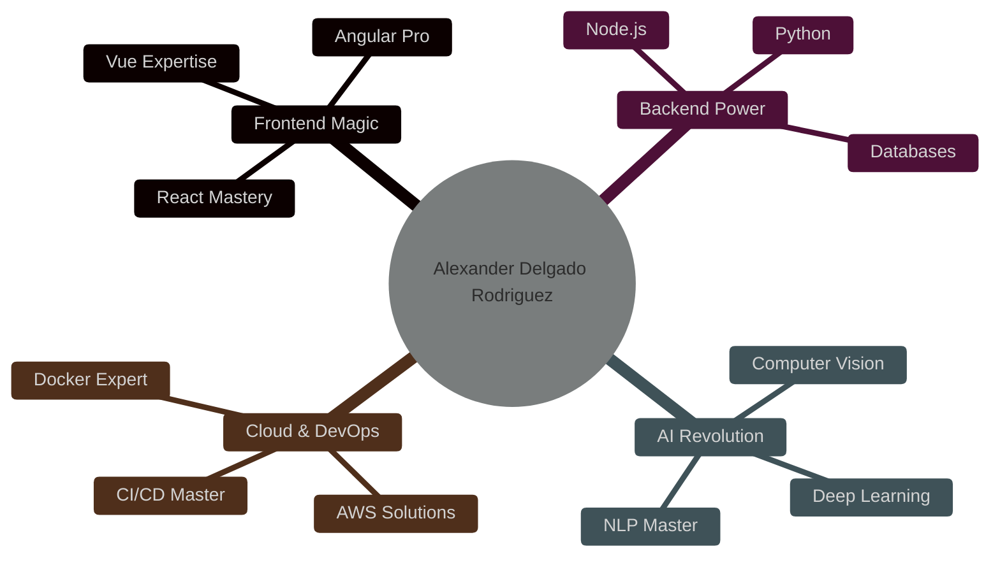

<h1 align="center">
  
</h1>

  

 

  

 

<h2 align="center">🎯 Mi Enfoque Profesional</h2>

   
  Frontend Development Expert
    
   
  Backend Development Specialist
    
   
  AI & Machine Learning Engineer
    
   
  DevOps & Cloud Architecture

 

<h2 align="center">🌟 Áreas de Experiencia</h2>

 

<h2 align="center">💪 Logros Profesionales</h2>

  <table border="0">
    <tr>
      <td align="center" width="300">
        
         
        <strong>100+ Proyectos</strong>
         
        Completados Exitosamente
      </td>
      <td align="center" width="300">
        
         
        <strong>90% Success Rate</strong>
         
        En Entregas de Proyectos
      </td>
      <td align="center" width="300">
        
         
        <strong>10+ Competencias</strong>
         
        Ganadas en Hackathons
      </td>
    </tr>
  </table>

 

  <h2>📫 Contáctame</h2>
  
  
  

 

  

