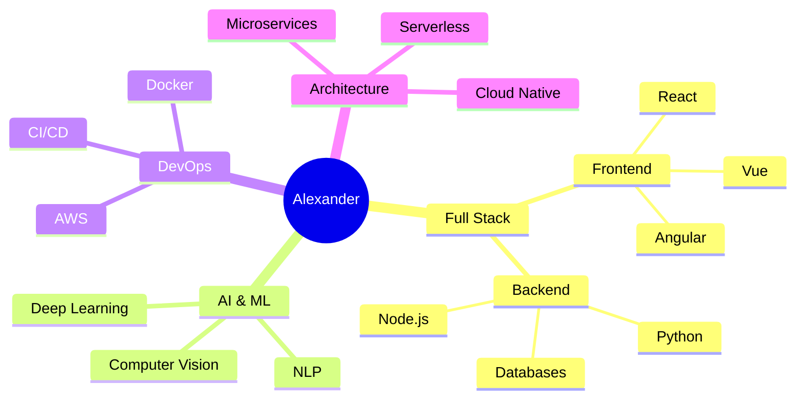

<h1 align="center">
  
</h1>

  

 

<h2 align="center">🧠 Ecosystem of Knowledge</h2>

<h2 align="center">💫 Technical Expertise</h2>

| Technology | Proficiency | Experience |
|:----------:|:-----------:|:----------:|
|  |  | 4 years |
|  |  | 3 years |
|  |  | 3 years |
|  |  | 4 years |
|  |  | 2 years |
|  |  | 2 years |

<h2 align="center">📊 Development Focus</h2>

  <table>
    <tr>
      <th>Area</th>
      <th>Proficiency</th>
    </tr>
    <tr>
      <td>Frontend Development</td>
      <td>
        
      </td>
    </tr>
    <tr>
      <td>Backend Development</td>
      <td>
        
      </td>
    </tr>
    <tr>
      <td>AI & Machine Learning</td>
      <td>
        
      </td>
    </tr>
    <tr>
      <td>DevOps & Cloud</td>
      <td>
        
      </td>
    </tr>
  </table>

<h2 align="center">🏆 Achievements</h2>

  <table>
    <tr>
      <td align="center">
        
         
        
      </td>
      <td align="center">
        
         
        
      </td>
      <td align="center">
        
         
        
      </td>
    </tr>
  </table>

 

  

