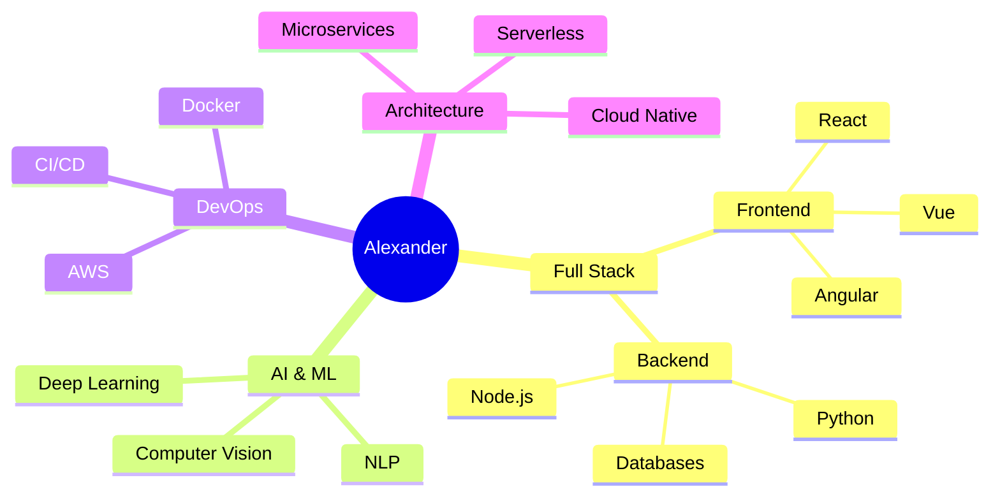

```txt
⠀⠀⠀⠀⠀⠀⠀⠀⠀⠀⠀⠀⠀⠀⠀⠀⠀⠀⠀⢀⣀⣀⣀⣀⠀⠀⠀⠀⠀⠀⠀⠀⠀⠀⠀⠀⠀⠀⠀⠀⠀⠀⠀⠀
⠀⠀⠀⠀⠀⠀⠀⠀⠀⠀⠀⠀⠀⠀⠀⠀⢀⣴⠾⠛⢉⣉⣉⣉⡙⠛⢷⣦⡀⠀⠀⠀⠀⠀⠀⠀⠀⠀⠀⠀⠀⠀⠀⠀
⠀⠀⠀⠀⠀⠀⠀⠀⠀⠀⠀⠀⠀⠀⣠⡴⠛⣡⠴⠚⠉⠉⠀⠈⠉⠙⠢⣝⠳⣄⠀⠀⠀⠀⠀⠀⠀⠀⠀⠀⠀⠀⠀⠀
⠀⠀⠀⠀⠀⠀⠀⠀⠀⠀⠀⠀⢀⡼⢋⡴⠋⠀⠀⠀⠀⠀⠀⠀⠀⠀⠀⠈⠳⡙⣦⡀⠀⠀⠀⠀⠀⠀⠀⠀⠀⠀⠀⠀
⠀⠀⠀⠀⠀⠀⠀⠀⠀⠀⠀⢠⡞⡱⠋⠀⠀⠀⠀⠀⠀⠀⠀⠀⠀⠀⠀⠀⠀⠙⢮⢷⡀⠀⠀⠀⠀⠀⠀⠀⠀⠀⠀⠀
⠀⠀⠀⠀⠀⠀⠀⠀⠀⠀⢠⡟⣰⠁⠀⠀⠀⠀⠀⠀⠀⠀⠀⠀⠀⠀⠀⠀⠀⠀⠈⢷⢻⡄⠀⠀⠀⠀⠀⠀⠀⠀⠀⠀
⠀⠀⠀⠀⠀⠀⠀⠀⠀⢠⡟⡴⠁⠀⠀⠀⠀⠀⠀⠀⠀⢀⣤⣤⣤⣤⣄⠀⠀⠀⠀⠘⣧⢹⡄⠀⠀⠀⠀⠀⠀⠀⠀⠀
⠀⠀⠀⠀⠀⠀⠀⠀⢠⡟⣼⠁⠀⠀⠀⠀⠀⠀⠀⠀⠀⢸⣿⣿⣿⣿⣿⠀⠀⠀⠀⠀⢸⣧⢻⡄⠀⠀⠀⠀⠀⠀⠀⠀
⠀⠀⠀⠀⠀⠀⠀⢠⡟⣼⠃⠀⠀⠀⠀⠀⠀⠀⠀⠀⠀⠸⣿⣿⣿⣿⡿⠀⠀⠀⠀⠀⠀⢻⣧⢻⡄⠀⠀⠀⠀⠀⠀⠀
⠀⠀⠀⠀⠀⠀⢠⡟⣼⠃⠀⠀⠀⠀⠀⠀⠀⠀⠀⠀⠀⠀⠉⠛⠛⠉⠁⠀⠀⠀⠀⠀⠀⠈⢻⣧⢻⡄⠀⠀⠀⠀⠀⠀
⠀⠀⠀⠀⠀⢠⡟⣼⠃⠀⠀⠀⠀⠀⠀⠀⠀⠀⠀⠀⠀⠀⠀⠀⠀⠀⠀⠀⠀⠀⠀⠀⠀⠀⠈⢻⣧⢻⡄⠀⠀⠀⠀⠀
⠀⠀⠀⠀⢠⡟⣼⠃⠀⠀⠀⠀⠀⠀⠀⠀⠀⠀⠀⠀⠀⠀⠀⠀⠀⠀⠀⠀⠀⠀⠀⠀⠀⠀⠀⠈⢻⣧⢻⡄⠀⠀⠀⠀
```

<h1 align="center">
  ⚡ Alexander | Full Stack & AI Engineer 🚀
</h1>

<p align="center">
  <em>Transformando ideas en soluciones innovadoras desde Costa Rica 🌴</em>
</p>

<div align="center">
  
```javascript
const alexander = {
    ubicación: "Costa Rica",
    rol: "Senior Full Stack & AI Engineer",
    código: ["Javascript", "Python", "Java", "C++"],
    tecnologías: {
        frontEnd: {
            js: ["React", "Vue", "Angular"],
            css: ["Tailwind", "Bootstrap", "SASS"]
        },
        backEnd: ["Node.js", "Express", "Django", "FastAPI"],
        devOps: ["AWS", "Docker", "Kubernetes", "Jenkins"],
        databases: ["MongoDB", "PostgreSQL", "MySQL"],
        AI: ["TensorFlow", "PyTorch", "Scikit-learn"]
    }
};
```

</div>

---

<h2 align="center">💻 Niveles de Habilidad</h2>

<div align="center">

| Tecnología    | Nivel de Experiencia                                               |
|---------------|------------------------------------------------------------------|
| JavaScript    | ⭐⭐⭐⭐⭐ `████████░░` 85%                                        |
| Python        | ⭐⭐⭐⭐⚪ `███████░░░` 75%                                        |
| React         | ⭐⭐⭐⭐⭐ `████████░░` 85%                                        |
| Node.js       | ⭐⭐⭐⭐⚪ `███████░░░` 75%                                        |
| AWS           | ⭐⭐⭐⚪⚪ `██████░░░░` 65%                                        |
| AI/ML         | ⭐⭐⭐⚪⚪ `██████░░░░` 65%                                        |

</div>

---

<h2 align="center">🏆 Logros Destacados</h2>

<div align="center">

```
🚀 100+ Proyectos Completados
⭐ 90% Tasa de Éxito en Entregas
🏆 10 Competencias Ganadas
```

</div>

---

<h2 align="center">🎯 Áreas de Especialización</h2>

<div align="center">



</div>

---

<h2 align="center">📊 Estadísticas de Desarrollo</h2>

<div align="center">

```
📱 Frontend     ████████░░   80%
💻 Backend      ███████░░░   70%
🤖 AI/ML        ██████░░░░   60%
☁️ Cloud        ███████░░░   70%
🔧 DevOps       ██████░░░░   60%
```

</div>

---

<h2 align="center">📫 Contacto</h2>

<div align="center">
  
[](https://linkedin.com/in/tuuser)
[](https://tuportfolio.com)
[](mailto:tu@email.com)
  
</div>

```txt
⠀⠀⠀⠀⠀⠀⠀⠀⠀⠀⠀⠀⠀⠀⠀⠀⢀⣀⣀⣀⣀⣀⠀⠀⠀⠀⠀⠀⠀⠀⠀⠀⠀⠀⠀⠀
⠀⠀⠀⠀⠀⠀⠀⠀⠀⠀⠀⠀⢀⣤⠖⠋⠉⠀⠀⠀⠀⠈⠉⠙⠲⣤⡀⠀⠀⠀⠀⠀⠀⠀⠀⠀
⠀⠀⠀⠀⠀⠀⠀⠀⠀⠀⢀⡴⠋⠀⠀⠀⠀⠀⠀⠀⠀⠀⠀⠀⠀⠈⠙⢦⡀⠀⠀⠀⠀⠀⠀⠀
⠀⠀⠀⠀⠀⠀⠀⠀⢀⡴⠋⠀⠀⠀⠀⠀⠀⠀⠀⠀⠀⠀⠀⠀⠀⠀⠀⠀⠙⢦⡀⠀⠀⠀⠀⠀
```
