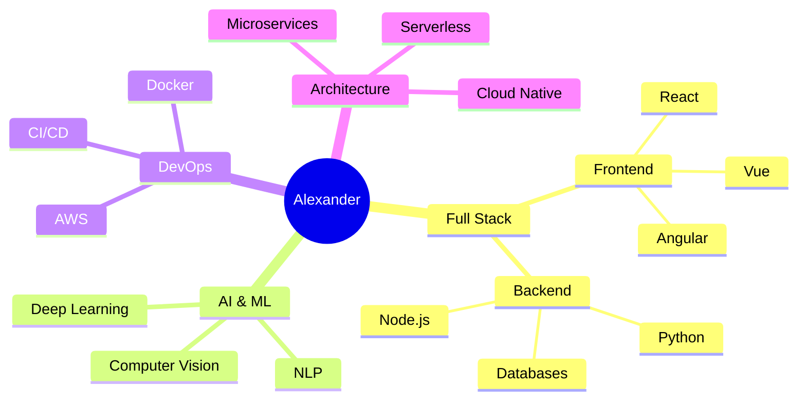

<h1 align="center">
  
</h1>

  

  
  
  

<h2 align="center">🧠 Ecosystem of Knowledge</h2>

<h2 align="center">💫 Technical Expertise</h2>

  

  
  
  

<h2 align="center">📊 GitHub Statistics</h2>

  
  
  

<h2 align="center">🏆 GitHub Trophies</h2>

  
  
  

<h2 align="center">📈 Contribution Graph</h2>

  
  
  

<h2 align="center">🌟 Featured Projects</h2>

  
  

  

  

