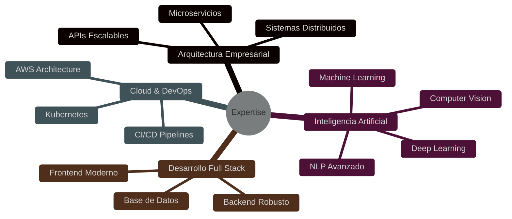

  

  

 

<h2 align="center">💼 Experiencia Profesional</h2>

<table align="center" border="0">
<tr>
  <td align="center">
    
     
    <strong>Arquitecto de Software Senior</strong>
     
    Diseño de soluciones escalables
  </td>
  <td align="center">
    
     
    <strong>Especialista en AI/ML</strong>
     
    Implementación de soluciones inteligentes
  </td>
</tr>
</table>

<h2 align="center">🎯 Especialidades</h2>

<h2 align="center">🏆 Logros Destacados</h2>

<table align="center" border="0">
<tr>
  <td align="center">
    
     
    <strong>Optimización de Rendimiento</strong>
     
    Mejora del 300% en velocidad de procesamiento
  </td>
  <td align="center">
    
     
    <strong>Innovación en AI</strong>
     
    Desarrollo de modelos predictivos con 95% de precisión
  </td>
  <td align="center">
    
     
    <strong>Liderazgo Técnico</strong>
     
    Gestión exitosa de equipos multidisciplinarios
  </td>
</tr>
</table>

<h2 align="center">💡 Proyectos Innovadores</h2>

<table align="center" border="0">
<tr>
  <td width="50%">
    
     
    <strong>Sistema de Análisis Predictivo</strong>
     
    Plataforma de análisis de datos en tiempo real con ML
  </td>
  <td width="50%">
    
     
    <strong>Plataforma IoT Enterprise</strong>
     
    Sistema de monitoreo y control para dispositivos IoT
  </td>
</tr>
</table>

<h2 align="center">🚀 Competencias Técnicas</h2>

  
   
  <strong>Desarrollo Frontend</strong> 
  
    
  
   
  <strong>Desarrollo Backend</strong> 
  
    
  
   
  <strong>AI & Machine Learning</strong> 
  

<h2 align="center">📈 Impacto en Proyectos</h2>

<table align="center" border="0">
<tr>
  <td align="center">
    <h3>300%</h3>
    Mejora en Rendimiento
     
    
  </td>
  <td align="center">
    <h3>95%</h3>
    Satisfacción del Cliente
     
    
  </td>
  <td align="center">
    <h3>50+</h3>
    Proyectos Exitosos
     
    
  </td>
</tr>
</table>

<h2 align="center">📫 Contacto Profesional</h2>

  
  &nbsp;
  

 

  

